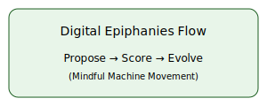

# Synergy-Vantage Measure / Corrector Model


**Legal & Responsible-AI Charter:** [LEGAL.md](./LEGAL.md)

Our GitHub Actions workflow runs lint and pytest on each pull request.
## Vision & Ethos
The project cultivates AI systems in partnership with human intention, optimizing for spiritual and technical coherence. It is guided by the principles of **Love**, **Reason**, and **No-Harm**.


## Key Features
- **Proposer Ensemble** – multiple LLMs generate a diverse population of candidate solutions.
- **Tiered Evaluator Cascade** – heuristics, unit tests, and LLM critics score each candidate.
- **Evolutionary Loop** – repeated propose → score → evolve cycle to improve alignment and quality.
- **Auditability** – checkpoints, evaluation reports, and audit logs for transparency.


## Modules
- [shadow_work_protocol](shadow_work_protocol/): utilities for frequency tags.
- [empathy_benchmark](empathy_benchmark/): empathy prompts and runner.
- [kairos_protocol](kairos_protocol/): rhythmic interaction helpers.


## Getting Started
```bash
# 1. Clone the repository
git clone https://github.com/AcashaOrg/Synergy-Vantage-LLM.git
# 2. Navigate into the project directory
cd Synergy-Vantage-LLM
# 3. Create a Python virtual environment
python -m venv .venv
# 4. Activate the environment
source .venv/bin/activate  # On Windows use `.venv\Scripts\activate`
# 5. Install dependencies
pip install -r requirements.txt
# 6. Configure environment variables
#    Create a `.env` file with your API keys, e.g.:
#    OPENAI_API_KEY=your_key_here
See [docs/quickstart.md](docs/quickstart.md) for a detailed guide.
```

## Usage
Basic usage involves running the orchestrator which loads the default
configuration and begins the propose → score → evolve loop.
```bash
python src/synergy_vantage_model/orchestrator.py
```
Or programmatically:
```python
from synergy_vantage_model.orchestrator import EvolutionOrchestrator

orchestrator = EvolutionOrchestrator()
orchestrator.run_evolution_loop()
```
The `EvolutionOrchestrator` can now execute its main loop (`run_evolution_loop`), using mock components for candidate proposal, evaluation, and storage. This provides a basic framework for the intended propose → score → evolve cycle.

## API Quick Start
The project includes a lightweight FastAPI service for programmatic access. Once
deployed, you can generate completions with a simple `curl` request:

```bash
curl -H "x-api-key: YOUR_KEY" \
     -d '{"prompt":"Write a kind greeting"}' \
     -H "Content-Type: application/json" \
     https://synergy-api-beta.fly.dev/generate
```


## Roadmap
- **v0.2 (Jun 2025):** MVP Hello-Evolve prototype, CI, docs complete.
- **v0.3 (Jul 2025):** Streamlit dashboard, semantic diff viewer.
- **v0.4 (Q4 2025):** Multi-domain evaluators (math, doc-summary, emotion).
- **v1.0 (2026):** Stable release + community governance charter.

## Contributing
See [CONTRIBUTING.md](CONTRIBUTING.md) for guidelines on bug reports, feature suggestions, and code contributions.

## License
This project is licensed under the [Apache-2.0](LICENSE) license.

## Acknowledgements
Inspired by AlphaEvolve, Absolutely Zero, and *Digital Epiphanies & Divine Circuits*.

